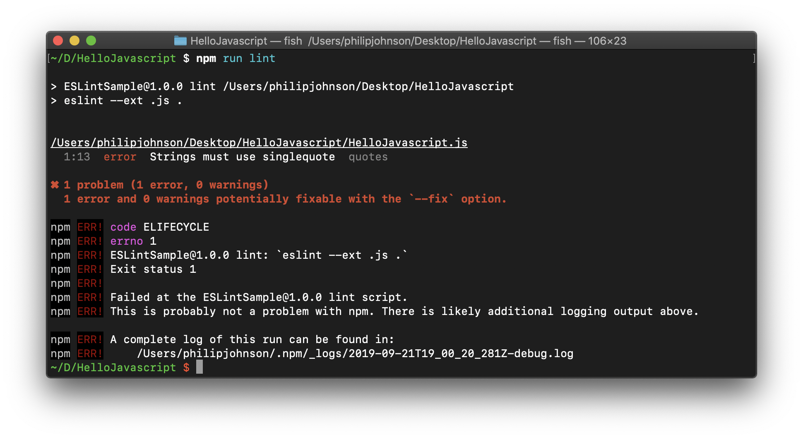

## Coding Standards and Keyboard Shortcuts

I view learning coding standards similarly to learning keyboard shortcuts. When I first began practicing keyboard shortcuts, it took me much longer to write code than if I had just used my mouse. Very often, I would find myself blankly staring at my screen while my fingers tried to remember how to jump to the end of a line. Over time, however, I got faster and faster, until I began working with just a keyboard much faster than when I used a keyboard and mouse.

## Why Bother?

I expect coding standards to have the same trajectory. Right now, as I learn them through ESLint, they feel like a hassle that only serves to eat up time. I find myself groaning over every trivial coding standard error, tediously counting my use of newlines. Wouldn’t it be so much faster if I stopped caring about coding standards and just wrote however I wanted to?

## The Time Saved

Abiding by coding standards, while time-consuming in the short term, will end up saving a lot of time in the long term. My code will become more readable and accessible to my future self and anybody I collaborate with. Instead of spending more time trying to decipher what my code does, they’ll be able to read it in a presentable, standard format. That is where the time savings come from. Right now, coding standards are a hassle, but my future self will thank me for learning them.
